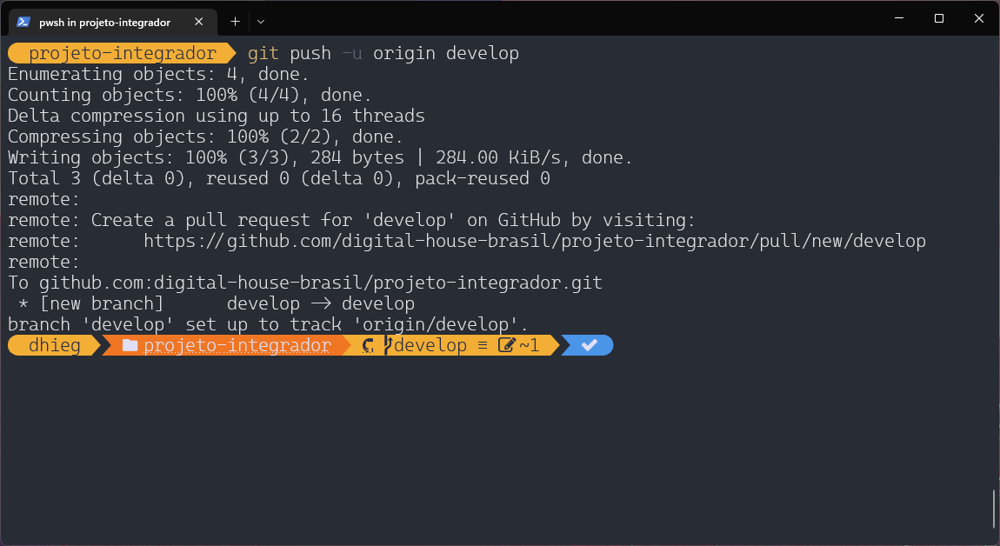

# Git Flow


<details>
<summary>git config --global user.email</summary>

> definir um nome de usuário e endereço de e-mail global 

- Comando: 
    ```cmd
    git config --global user.email "dhiego_ti@hotmail.com"
    ```


</details>

<details>
<summary>git init</summary>

> Inicia um repositório

- Comando: 
    ```cmd
    git init
    ```


</details>

<details>
<summary>git clone</summary>


</details>

<details>
<summary>git branch</summary>

> `git branch "Nome da branch"` usado para criar uma nova branch

- Comando: 
    ```cmd
    git branch develop
    ```


</details>

<details>
<summary>git branch --list</summary>

> Usado obter uma lista de todas as ramificações do controle remoto

- Comando: 
    ```cmd
    git branch --list
    ```


</details>

<details>
<summary>git checkout</summary>

> O comando `git checkout "nome da branch"` faz a troca entre branches ou restaura arquivos da árvore de trabalho. 

- Comando: 
    ```cmd
    git checkout develop	
    ```


</details>

<details>
<summary>git branch -d "Nome da branch"</summary>

> Use a opção -d se quiser excluir uma branch local.

- Comando: 
    ```cmd
    git branch -d develop
    ```


</details>

<details>
<summary>git checkout -b</summary>

> Cria uma nova branch e da checkout nela

- Comando: 
    ```cmd
    git checkout -b develop	
    ```


</details>

<details>
<summary>git status</summary>

> Lista sua branch atual, os commits atuais e os arquivos modificados

- Comando: 
    ```cmd
    git status
    ```


</details>

<details>
<summary>git add</summary>

> `git add .` prepara todos os arquivos modificados para serem adicionados ao próximo commit

> `git add "nome do arquivo"` Prepara o arquivo para ser adicionado ao próximo commit

- Comando: 
    ```cmd
    git add .    
    ```


</details>

<details>
<summary>git reset</summary>

> `git reset .` desprepara todos os arquivos

> `git reset "nome do arquivo"` desprepara um arquivo

- Comando: 
    ```cmd
    git reset .
    ```


</details>

<details>
<summary>git commit -m</summary>

> Cria um commit com todos os arquivos preparados

- Comando: 
    ```cmd
    git commit -m "Mensagem"	
    ```


</details>

<details>
<summary>git push -u origin</summary>

> Empurra a branch atual para uma branch na origem, dando merge em suas mudanças se tiver permissão para isso

- Comando: 
    ```cmd
    git push -u origin nome-da-branch	
    ```



</details>

<details>
<summary>pull request</summary>

> Pull request é um mecanismo onde um desenvolvedor pode gerar uma notificação que sinaliza a conclusão do desenvolvimento de uma feature qualquer. Isso permite que todos os envolvidos saibam que precisam fazer o merge do código na branch principal.


</details>

<details>
<summary>git pull origin</summary>

> Puxa uma branch na origem para a branch atual, dando merge em suas mudanças

- Comando: 
    ```cmd
    git pull origin nome-da-branch		
    ```


</details>